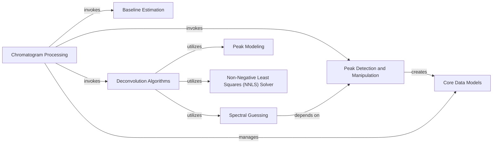

## Component Details

This graph illustrates the architecture of the Chromatogram Processing subsystem, which is central to analyzing chromatographic data. The main flow involves the 'Chromatogram Processing' component orchestrating baseline correction, peak detection, and deconvolution. It leverages specialized components like 'Baseline Estimation' for noise removal, 'Peak Detection and Manipulation' for identifying and refining peaks, and 'Deconvolution Algorithms' for resolving overlapping peaks. The deconvolution process further relies on 'Peak Modeling' for mathematical representations of peaks, 'Spectral Guessing' for initial spectral estimations, and 'Non-Negative Least Squares (NNLS) Solver' for concentration and spectra calculations. All these operations interact with 'Core Data Models' to manage the fundamental data structures of the system.

### Chromatogram Processing
This component acts as the central orchestrator for processing individual chromatograms. It manages the overall workflow, including baseline correction, peak detection, and deconvolution, by interacting with specialized sub-components. It also handles the creation and management of Peak and DeconvolvedPeak objects.

**Related Classes/Methods**:

- <a href="https://github.com/Bayer-Group/MOCCA/blob/master/src/mocca2/classes/chromatogram.py#L27-L579" target="_blank" rel="noopener noreferrer">`mocca2.classes.chromatogram.Chromatogram` (27:579)</a>
- <a href="https://github.com/Bayer-Group/MOCCA/blob/master/src/mocca2/classes/chromatogram.py#L100-L145" target="_blank" rel="noopener noreferrer">`mocca2.classes.chromatogram.Chromatogram:correct_baseline` (100:145)</a>
- <a href="https://github.com/Bayer-Group/MOCCA/blob/master/src/mocca2/classes/chromatogram.py#L147-L229" target="_blank" rel="noopener noreferrer">`mocca2.classes.chromatogram.Chromatogram:find_peaks` (147:229)</a>
- <a href="https://github.com/Bayer-Group/MOCCA/blob/master/src/mocca2/classes/chromatogram.py#L231-L295" target="_blank" rel="noopener noreferrer">`mocca2.classes.chromatogram.Chromatogram:deconvolve_peaks` (231:295)</a>
- <a href="https://github.com/Bayer-Group/MOCCA/blob/master/src/mocca2/classes/chromatogram.py#L401-L473" target="_blank" rel="noopener noreferrer">`mocca2.classes.chromatogram.Chromatogram:refine_peaks` (401:473)</a>

### Baseline Estimation
This component is responsible for estimating and correcting the baseline of chromatographic data. It provides various algorithms to remove signal drift and noise.

**Related Classes/Methods**:

- <a href="https://github.com/Bayer-Group/MOCCA/blob/master/src/mocca2/baseline/wrapper.py#L16-L98" target="_blank" rel="noopener noreferrer">`mocca2.baseline.wrapper.estimate_baseline` (16:98)</a>
- <a href="https://github.com/Bayer-Group/MOCCA/blob/master/src/mocca2/baseline/arpls.py#L17-L147" target="_blank" rel="noopener noreferrer">`mocca2.baseline.arpls.arpls` (17:147)</a>
- <a href="https://github.com/Bayer-Group/MOCCA/blob/master/src/mocca2/baseline/asls.py#L15-L129" target="_blank" rel="noopener noreferrer">`mocca2.baseline.asls.asls` (15:129)</a>
- <a href="https://github.com/Bayer-Group/MOCCA/blob/master/src/mocca2/baseline/flatfit.py#L16-L76" target="_blank" rel="noopener noreferrer">`mocca2.baseline.flatfit.flatfit` (16:76)</a>

### Peak Detection and Manipulation
This component handles the identification, splitting, and merging of peaks in the chromatogram. It ensures accurate delineation of individual chromatographic events.

**Related Classes/Methods**:

- <a href="https://github.com/Bayer-Group/MOCCA/blob/master/src/mocca2/peaks/find_peaks.py#L13-L101" target="_blank" rel="noopener noreferrer">`mocca2.peaks.find_peaks.find_peaks` (13:101)</a>
- <a href="https://github.com/Bayer-Group/MOCCA/blob/master/src/mocca2/peaks/find_peaks.py#L104-L134" target="_blank" rel="noopener noreferrer">`mocca2.peaks.find_peaks._initial_peak_picking` (104:134)</a>
- <a href="https://github.com/Bayer-Group/MOCCA/blob/master/src/mocca2/peaks/split.py#L8-L33" target="_blank" rel="noopener noreferrer">`mocca2.peaks.split.split_peaks` (8:33)</a>
- <a href="https://github.com/Bayer-Group/MOCCA/blob/master/src/mocca2/peaks/split.py#L35-L85" target="_blank" rel="noopener noreferrer">`mocca2.peaks.split._split_peak` (35:85)</a>
- <a href="https://github.com/Bayer-Group/MOCCA/blob/master/src/mocca2/peaks/merge_overlapping.py#L7-L40" target="_blank" rel="noopener noreferrer">`mocca2.peaks.merge_overlapping.merge_overlapping_peaks` (7:40)</a>
- <a href="https://github.com/Bayer-Group/MOCCA/blob/master/src/mocca2/peaks/merge_overlapping.py#L49-L60" target="_blank" rel="noopener noreferrer">`mocca2.peaks.merge_overlapping._merge_two_peaks` (49:60)</a>

### Deconvolution Algorithms
This component provides the core algorithms for deconvolving complex chromatographic peaks into their underlying individual components. It includes adaptive and fixed deconvolution strategies and methods for fitting peak models.

**Related Classes/Methods**:

- <a href="https://github.com/Bayer-Group/MOCCA/blob/master/src/mocca2/deconvolution/deconvolve.py#L11-L74" target="_blank" rel="noopener noreferrer">`mocca2.deconvolution.deconvolve.deconvolve_adaptive` (11:74)</a>
- <a href="https://github.com/Bayer-Group/MOCCA/blob/master/src/mocca2/deconvolution/deconvolve.py#L77-L126" target="_blank" rel="noopener noreferrer">`mocca2.deconvolution.deconvolve.deconvolve_fixed` (77:126)</a>
- <a href="https://github.com/Bayer-Group/MOCCA/blob/master/src/mocca2/deconvolution/fit_peak_model.py#L20-L264" target="_blank" rel="noopener noreferrer">`mocca2.deconvolution.fit_peak_model.fit_peak_model` (20:264)</a>
- <a href="https://github.com/Bayer-Group/MOCCA/blob/master/src/mocca2/deconvolution/alternating_lstsq.py#L12-L105" target="_blank" rel="noopener noreferrer">`mocca2.deconvolution.alternating_lstsq.alternating_lstsq` (12:105)</a>

### Spectral Guessing
This component is responsible for generating initial guesses for spectra during the deconvolution process, often using similarity metrics.

**Related Classes/Methods**:

- <a href="https://github.com/Bayer-Group/MOCCA/blob/master/src/mocca2/deconvolution/guess_spectra.py#L11-L54" target="_blank" rel="noopener noreferrer">`mocca2.deconvolution.guess_spectra.guess_spectra` (11:54)</a>
- <a href="https://github.com/Bayer-Group/MOCCA/blob/master/src/mocca2/deconvolution/guess_spectra.py#L57-L69" target="_blank" rel="noopener noreferrer">`mocca2.deconvolution.guess_spectra._get_similarity_matrix` (57:69)</a>

### Non-Negative Least Squares (NNLS) Solver
This component provides mathematical routines for solving non-negative least squares problems, crucial for estimating concentrations and spectra during deconvolution.

**Related Classes/Methods**:

- <a href="https://github.com/Bayer-Group/MOCCA/blob/master/src/mocca2/deconvolution/nonnegative_lstsq.py#L11-L53" target="_blank" rel="noopener noreferrer">`mocca2.deconvolution.nonnegative_lstsq.concentrations_from_spectra` (11:53)</a>
- <a href="https://github.com/Bayer-Group/MOCCA/blob/master/src/mocca2/deconvolution/nonnegative_lstsq.py#L56-L83" target="_blank" rel="noopener noreferrer">`mocca2.deconvolution.nonnegative_lstsq.spectra_from_concentrations` (56:83)</a>
- <a href="https://github.com/Bayer-Group/MOCCA/blob/master/src/mocca2/deconvolution/nnls.py#L8-L70" target="_blank" rel="noopener noreferrer">`mocca2.deconvolution.nnls.nnls` (8:70)</a>

### Peak Modeling
This component defines and implements various mathematical models used to describe the characteristic shapes of chromatographic peaks, utilized by the deconvolution process.

**Related Classes/Methods**:

- <a href="https://github.com/Bayer-Group/MOCCA/blob/master/src/mocca2/deconvolution/peak_models.py#L14-L53" target="_blank" rel="noopener noreferrer">`mocca2.deconvolution.peak_models.PeakModel` (14:53)</a>
- <a href="https://github.com/Bayer-Group/MOCCA/blob/master/src/mocca2/deconvolution/peak_models.py#L17-L21" target="_blank" rel="noopener noreferrer">`mocca2.deconvolution.peak_models.PeakModel:__call__` (17:21)</a>
- <a href="https://github.com/Bayer-Group/MOCCA/blob/master/src/mocca2/deconvolution/peak_models.py#L240-L329" target="_blank" rel="noopener noreferrer">`mocca2.deconvolution.peak_models.Bemg` (240:329)</a>
- <a href="https://github.com/Bayer-Group/MOCCA/blob/master/src/mocca2/deconvolution/peak_models.py#L246-L266" target="_blank" rel="noopener noreferrer">`mocca2.deconvolution.peak_models.Bemg:val` (246:266)</a>
- <a href="https://github.com/Bayer-Group/MOCCA/blob/master/src/mocca2/deconvolution/peak_models.py#L268-L310" target="_blank" rel="noopener noreferrer">`mocca2.deconvolution.peak_models.Bemg:grad` (268:310)</a>
- <a href="https://github.com/Bayer-Group/MOCCA/blob/master/src/mocca2/deconvolution/peak_models.py#L80-L115" target="_blank" rel="noopener noreferrer">`mocca2.deconvolution.peak_models.BiGaussian` (80:115)</a>
- <a href="https://github.com/Bayer-Group/MOCCA/blob/master/src/mocca2/deconvolution/peak_models.py#L118-L167" target="_blank" rel="noopener noreferrer">`mocca2.deconvolution.peak_models.BiGaussianTailing` (118:167)</a>
- <a href="https://github.com/Bayer-Group/MOCCA/blob/master/src/mocca2/deconvolution/peak_models.py#L170-L230" target="_blank" rel="noopener noreferrer">`mocca2.deconvolution.peak_models.FraserSuzuki` (170:230)</a>

### Core Data Models
This component defines the fundamental data structures used throughout the system, representing 2D chromatographic data, peaks, deconvolved peaks, components, and compounds.

**Related Classes/Methods**:

- <a href="https://github.com/Bayer-Group/MOCCA/blob/master/src/mocca2/classes/data2d.py#L13-L321" target="_blank" rel="noopener noreferrer">`mocca2.classes.data2d.Data2D` (13:321)</a>
- <a href="https://github.com/Bayer-Group/MOCCA/blob/master/src/mocca2/classes/peak.py#L9-L67" target="_blank" rel="noopener noreferrer">`mocca2.classes.peak.Peak` (9:67)</a>
- <a href="https://github.com/Bayer-Group/MOCCA/blob/master/src/mocca2/classes/deconvolved_peak.py#L11-L142" target="_blank" rel="noopener noreferrer">`mocca2.classes.deconvolved_peak.DeconvolvedPeak` (11:142)</a>
- <a href="https://github.com/Bayer-Group/MOCCA/blob/master/src/mocca2/classes/component.py#L10-L73" target="_blank" rel="noopener noreferrer">`mocca2.classes.component.Component` (10:73)</a>
- <a href="https://github.com/Bayer-Group/MOCCA/blob/master/src/mocca2/classes/compound.py#L12-L94" target="_blank" rel="noopener noreferrer">`mocca2.classes.compound.Compound` (12:94)</a>

### [FAQ](https://github.com/CodeBoarding/GeneratedOnBoardings/tree/main?tab=readme-ov-file#faq)