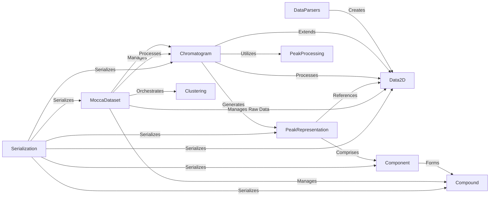

## Component Details

This graph describes the core data structures and their interactions within the MOCCA system, focusing on how chromatographic data is represented, processed, and managed. It illustrates the hierarchy from raw 2D data to derived entities like peaks, components, and compounds, and how these structures are handled by various processing and management components. The main flow involves parsing raw data into Data2D objects, which are then processed into Chromatogram objects. These Chromatograms undergo peak detection and deconvolution, leading to PeakRepresentation, Component, and Compound entities. A central MoccaDataset manages collections of Chromatograms and Compounds, orchestrating the overall data analysis pipeline, while a Serialization component handles data persistence.

### Data2D
The Data2D component is the fundamental data structure for representing two-dimensional chromatographic data, typically absorbance over time and wavelength. It provides core functionalities for data manipulation such as extracting specific time or wavelength ranges, interpolating data, and performing arithmetic operations. It also includes methods for plotting and serialization.

**Related Classes/Methods**:

- <a href="https://github.com/Bayer-Group/MOCCA/blob/master/src/mocca2/classes/data2d.py#L13-L321" target="_blank" rel="noopener noreferrer">`MOCCA.src.mocca2.classes.data2d.Data2D` (13:321)</a>
- <a href="https://github.com/Bayer-Group/MOCCA/blob/master/src/mocca2/classes/data2d.py#L28-L30" target="_blank" rel="noopener noreferrer">`MOCCA.src.mocca2.classes.data2d.Data2D:closest_time` (28:30)</a>
- <a href="https://github.com/Bayer-Group/MOCCA/blob/master/src/mocca2/classes/data2d.py#L32-L34" target="_blank" rel="noopener noreferrer">`MOCCA.src.mocca2.classes.data2d.Data2D:closest_wavelength` (32:34)</a>
- <a href="https://github.com/Bayer-Group/MOCCA/blob/master/src/mocca2/classes/data2d.py#L36-L79" target="_blank" rel="noopener noreferrer">`MOCCA.src.mocca2.classes.data2d.Data2D:extract_time` (36:79)</a>
- <a href="https://github.com/Bayer-Group/MOCCA/blob/master/src/mocca2/classes/data2d.py#L81-L126" target="_blank" rel="noopener noreferrer">`MOCCA.src.mocca2.classes.data2d.Data2D:extract_wavelength` (81:126)</a>
- <a href="https://github.com/Bayer-Group/MOCCA/blob/master/src/mocca2/classes/data2d.py#L157-L177" target="_blank" rel="noopener noreferrer">`MOCCA.src.mocca2.classes.data2d.Data2D:interpolate_time` (157:177)</a>
- <a href="https://github.com/Bayer-Group/MOCCA/blob/master/src/mocca2/classes/data2d.py#L228-L233" target="_blank" rel="noopener noreferrer">`MOCCA.src.mocca2.classes.data2d.Data2D:__add__` (228:233)</a>
- <a href="https://github.com/Bayer-Group/MOCCA/blob/master/src/mocca2/classes/data2d.py#L235-L240" target="_blank" rel="noopener noreferrer">`MOCCA.src.mocca2.classes.data2d.Data2D:__sub__` (235:240)</a>
- <a href="https://github.com/Bayer-Group/MOCCA/blob/master/src/mocca2/classes/data2d.py#L243-L251" target="_blank" rel="noopener noreferrer">`MOCCA.src.mocca2.classes.data2d.Data2D:to_dict` (243:251)</a>
- <a href="https://github.com/Bayer-Group/MOCCA/blob/master/src/mocca2/classes/data2d.py#L254-L260" target="_blank" rel="noopener noreferrer">`MOCCA.src.mocca2.classes.data2d.Data2D:from_dict` (254:260)</a>
- <a href="https://github.com/Bayer-Group/MOCCA/blob/master/src/mocca2/classes/data2d.py#L263-L290" target="_blank" rel="noopener noreferrer">`MOCCA.src.mocca2.classes.data2d.Data2D:plot` (263:290)</a>

### Chromatogram
The Chromatogram component extends Data2D and provides a high-level interface for processing a single chromatogram. It encapsulates the raw data, detected peaks, and metadata like sample and blank paths. This component orchestrates various processing steps including baseline correction, peak finding, and deconvolution, and offers methods to calculate peak area percentages and integrals.

**Related Classes/Methods**:

- <a href="https://github.com/Bayer-Group/MOCCA/blob/master/src/mocca2/classes/chromatogram.py#L27-L579" target="_blank" rel="noopener noreferrer">`MOCCA.src.mocca2.classes.chromatogram.Chromatogram` (27:579)</a>
- <a href="https://github.com/Bayer-Group/MOCCA/blob/master/src/mocca2/classes/chromatogram.py#L42-L98" target="_blank" rel="noopener noreferrer">`MOCCA.src.mocca2.classes.chromatogram.Chromatogram:__init__` (42:98)</a>
- <a href="https://github.com/Bayer-Group/MOCCA/blob/master/src/mocca2/classes/chromatogram.py#L312-L349" target="_blank" rel="noopener noreferrer">`MOCCA.src.mocca2.classes.chromatogram.Chromatogram:get_area_percent` (312:349)</a>
- <a href="https://github.com/Bayer-Group/MOCCA/blob/master/src/mocca2/classes/chromatogram.py#L351-L368" target="_blank" rel="noopener noreferrer">`MOCCA.src.mocca2.classes.chromatogram.Chromatogram:get_integrals` (351:368)</a>
- <a href="https://github.com/Bayer-Group/MOCCA/blob/master/src/mocca2/classes/chromatogram.py#L370-L399" target="_blank" rel="noopener noreferrer">`MOCCA.src.mocca2.classes.chromatogram.Chromatogram:get_relative_integrals` (370:399)</a>
- <a href="https://github.com/Bayer-Group/MOCCA/blob/master/src/mocca2/classes/chromatogram.py#L476-L484" target="_blank" rel="noopener noreferrer">`MOCCA.src.mocca2.classes.chromatogram.Chromatogram:to_dict` (476:484)</a>
- <a href="https://github.com/Bayer-Group/MOCCA/blob/master/src/mocca2/classes/chromatogram.py#L487-L508" target="_blank" rel="noopener noreferrer">`MOCCA.src.mocca2.classes.chromatogram.Chromatogram:from_dict` (487:508)</a>
- <a href="https://github.com/Bayer-Group/MOCCA/blob/master/src/mocca2/classes/chromatogram.py#L511-L579" target="_blank" rel="noopener noreferrer">`MOCCA.src.mocca2.classes.chromatogram.Chromatogram:plot` (511:579)</a>

### PeakRepresentation
The PeakRepresentation component encompasses both simple detected peaks (Peak) and peaks that have been further analyzed and broken down into individual chemical components (DeconvolvedPeak). It stores information about peak boundaries, height, prominence, and for deconvolved peaks, includes deconvolution metrics and a list of associated Component objects.

**Related Classes/Methods**:

- <a href="https://github.com/Bayer-Group/MOCCA/blob/master/src/mocca2/classes/peak.py#L9-L67" target="_blank" rel="noopener noreferrer">`MOCCA.src.mocca2.classes.peak.Peak` (9:67)</a>
- <a href="https://github.com/Bayer-Group/MOCCA/blob/master/src/mocca2/classes/peak.py#L51-L53" target="_blank" rel="noopener noreferrer">`MOCCA.src.mocca2.classes.peak.Peak:to_dict` (51:53)</a>
- <a href="https://github.com/Bayer-Group/MOCCA/blob/master/src/mocca2/classes/peak.py#L56-L67" target="_blank" rel="noopener noreferrer">`MOCCA.src.mocca2.classes.peak.Peak:from_dict` (56:67)</a>
- <a href="https://github.com/Bayer-Group/MOCCA/blob/master/src/mocca2/classes/deconvolved_peak.py#L11-L142" target="_blank" rel="noopener noreferrer">`MOCCA.src.mocca2.classes.deconvolved_peak.DeconvolvedPeak` (11:142)</a>
- <a href="https://github.com/Bayer-Group/MOCCA/blob/master/src/mocca2/classes/deconvolved_peak.py#L26-L74" target="_blank" rel="noopener noreferrer">`MOCCA.src.mocca2.classes.deconvolved_peak.DeconvolvedPeak:__init__` (26:74)</a>
- <a href="https://github.com/Bayer-Group/MOCCA/blob/master/src/mocca2/classes/deconvolved_peak.py#L76-L112" target="_blank" rel="noopener noreferrer">`MOCCA.src.mocca2.classes.deconvolved_peak.DeconvolvedPeak:merge_same_components` (76:112)</a>
- <a href="https://github.com/Bayer-Group/MOCCA/blob/master/src/mocca2/classes/deconvolved_peak.py#L114-L123" target="_blank" rel="noopener noreferrer">`MOCCA.src.mocca2.classes.deconvolved_peak.DeconvolvedPeak:to_dict` (114:123)</a>
- <a href="https://github.com/Bayer-Group/MOCCA/blob/master/src/mocca2/classes/deconvolved_peak.py#L126-L142" target="_blank" rel="noopener noreferrer">`MOCCA.src.mocca2.classes.deconvolved_peak.DeconvolvedPeak:from_dict` (126:142)</a>

### Component
The Component component represents a single chemical entity identified within a deconvolved peak. It stores the concentration profile, spectrum, elution time, integral, and a unique compound ID if assigned. This component is a building block for defining larger chemical compounds.

**Related Classes/Methods**:

- <a href="https://github.com/Bayer-Group/MOCCA/blob/master/src/mocca2/classes/component.py#L10-L73" target="_blank" rel="noopener noreferrer">`MOCCA.src.mocca2.classes.component.Component` (10:73)</a>
- <a href="https://github.com/Bayer-Group/MOCCA/blob/master/src/mocca2/classes/component.py#L51-L56" target="_blank" rel="noopener noreferrer">`MOCCA.src.mocca2.classes.component.Component:to_dict` (51:56)</a>
- <a href="https://github.com/Bayer-Group/MOCCA/blob/master/src/mocca2/classes/component.py#L59-L73" target="_blank" rel="noopener noreferrer">`MOCCA.src.mocca2.classes.component.Component:from_dict` (59:73)</a>

### Compound
The Compound component represents a distinct chemical compound, which can be derived by clustering similar Component objects across multiple chromatograms. It stores the averaged elution time, spectrum, name, and concentration factors, providing a consolidated view of a chemical species.

**Related Classes/Methods**:

- <a href="https://github.com/Bayer-Group/MOCCA/blob/master/src/mocca2/classes/compound.py#L12-L94" target="_blank" rel="noopener noreferrer">`MOCCA.src.mocca2.classes.compound.Compound` (12:94)</a>
- <a href="https://github.com/Bayer-Group/MOCCA/blob/master/src/mocca2/classes/compound.py#L69-L73" target="_blank" rel="noopener noreferrer">`MOCCA.src.mocca2.classes.compound.Compound:to_dict` (69:73)</a>
- <a href="https://github.com/Bayer-Group/MOCCA/blob/master/src/mocca2/classes/compound.py#L76-L94" target="_blank" rel="noopener noreferrer">`MOCCA.src.mocca2.classes.compound.Compound:from_dict` (76:94)</a>

### MoccaDataset
The MoccaDataset component serves as the central manager for a collection of Chromatogram objects and the Compounds identified within them. It orchestrates the entire data processing pipeline, including wavelength cropping, baseline correction, peak picking, deconvolution, and component clustering. It also provides high-level data analysis functionalities such as calculating area percentages and concentrations across the dataset.

**Related Classes/Methods**:

- <a href="https://github.com/Bayer-Group/MOCCA/blob/master/src/mocca2/dataset/dataset.py#L20-L804" target="_blank" rel="noopener noreferrer">`mocca2.dataset.dataset.MoccaDataset` (20:804)</a>

### DataParsers
The DataParsers component is a collection of utility functions responsible for reading and parsing raw chromatographic data files from various instrument-specific formats (e.g., Chemstation, Labsolutions, Empower, Masslynx). Its primary role is to convert these raw files into the standardized Data2D object format for further processing within the MOCCA system.

**Related Classes/Methods**:

- <a href="https://github.com/Bayer-Group/MOCCA/blob/master/src/mocca2/parsers/chemstation.py#L6-L20" target="_blank" rel="noopener noreferrer">`mocca2.parsers.chemstation.parse_chemstation` (6:20)</a>
- <a href="https://github.com/Bayer-Group/MOCCA/blob/master/src/mocca2/parsers/labsolutions.py#L5-L17" target="_blank" rel="noopener noreferrer">`mocca2.parsers.labsolutions.parse_labsolutions` (5:17)</a>
- <a href="https://github.com/Bayer-Group/MOCCA/blob/master/src/mocca2/parsers/empower.py#L6-L30" target="_blank" rel="noopener noreferrer">`mocca2.parsers.empower.parse_empower` (6:30)</a>
- <a href="https://github.com/Bayer-Group/MOCCA/blob/master/src/mocca2/parsers/masslynx.py#L8-L17" target="_blank" rel="noopener noreferrer">`mocca2.parsers.masslynx.parse_masslynx` (8:17)</a>

### PeakProcessing
The PeakProcessing component encapsulates the algorithms and logic for identifying, refining, and manipulating peaks within 1D chromatographic data. This includes initial peak detection, expanding peak borders to the baseline, merging overlapping peaks, and splitting complex merged peaks into simpler ones.

**Related Classes/Methods**:

- <a href="https://github.com/Bayer-Group/MOCCA/blob/master/src/mocca2/peaks/find_peaks.py#L104-L134" target="_blank" rel="noopener noreferrer">`mocca2.peaks.find_peaks._initial_peak_picking` (104:134)</a>
- <a href="https://github.com/Bayer-Group/MOCCA/blob/master/src/mocca2/peaks/split.py#L35-L85" target="_blank" rel="noopener noreferrer">`mocca2.peaks.split._split_peak` (35:85)</a>
- <a href="https://github.com/Bayer-Group/MOCCA/blob/master/src/mocca2/peaks/merge_overlapping.py#L49-L60" target="_blank" rel="noopener noreferrer">`mocca2.peaks.merge_overlapping._merge_two_peaks` (49:60)</a>

### Clustering
The Clustering component is responsible for grouping similar Component objects, which represent individual chemical entities, into larger, more generalized Compound objects. This process involves applying similarity criteria to identify and average components that are likely to belong to the same chemical compound across different chromatograms.

**Related Classes/Methods**:

- <a href="https://github.com/Bayer-Group/MOCCA/blob/master/src/mocca2/clustering/cluster_components.py#L10-L85" target="_blank" rel="noopener noreferrer">`mocca2.clustering.cluster_components.cluster_components` (10:85)</a>

### Serialization
The Serialization component provides a utility for converting complex Python objects, including NumPy arrays and Pandas DataFrames, into a dictionary format. This enables the persistence and reconstruction of MOCCA's data structures, facilitating saving and loading of processed data.

**Related Classes/Methods**:

- <a href="https://github.com/Bayer-Group/MOCCA/blob/master/src/mocca2/serializing.py#L5-L28" target="_blank" rel="noopener noreferrer">`mocca2.serializing.dict_encoder` (5:28)</a>

### [FAQ](https://github.com/CodeBoarding/GeneratedOnBoardings/tree/main?tab=readme-ov-file#faq)