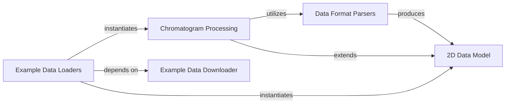

## Component Details

This graph describes the Data Ingestion subsystem, which is responsible for parsing raw chromatographic data from various instrument-specific formats into internal Core Data Structures. It also provides access to example datasets for testing and demonstration.

### Data Format Parsers
This component is responsible for parsing various proprietary raw chromatographic data formats (Empower, Chemstation, LabSolutions, MassLynx) into a standardized Data2D object. It provides a unified interface `load_data2d` to automatically detect and parse the file format.

**Related Classes/Methods**:

- <a href="https://github.com/Bayer-Group/MOCCA/blob/master/src/mocca2/parsers/chemstation.py#L6-L20" target="_blank" rel="noopener noreferrer">`MOCCA.src.mocca2.parsers.chemstation:parse_chemstation` (6:20)</a>
- <a href="https://github.com/Bayer-Group/MOCCA/blob/master/src/mocca2/parsers/labsolutions.py#L5-L17" target="_blank" rel="noopener noreferrer">`MOCCA.src.mocca2.parsers.labsolutions:parse_labsolutions` (5:17)</a>
- <a href="https://github.com/Bayer-Group/MOCCA/blob/master/src/mocca2/parsers/empower.py#L6-L30" target="_blank" rel="noopener noreferrer">`MOCCA.src.mocca2.parsers.empower:parse_empower` (6:30)</a>
- <a href="https://github.com/Bayer-Group/MOCCA/blob/master/src/mocca2/parsers/masslynx.py#L8-L17" target="_blank" rel="noopener noreferrer">`MOCCA.src.mocca2.parsers.masslynx:parse_masslynx` (8:17)</a>
- <a href="https://github.com/Bayer-Group/MOCCA/blob/master/src/mocca2/parsers/wrapper.py#L10-L69" target="_blank" rel="noopener noreferrer">`MOCCA.src.mocca2.parsers.wrapper:load_data2d` (10:69)</a>

### 2D Data Model
This component defines the `Data2D` class, which is the fundamental data structure for representing 2D chromatographic data (time, wavelength, and absorbance). It provides methods for data manipulation such as extraction, interpolation, and basic plotting.

**Related Classes/Methods**:

- <a href="https://github.com/Bayer-Group/MOCCA/blob/master/src/mocca2/classes/data2d.py#L13-L321" target="_blank" rel="noopener noreferrer">`MOCCA.src.mocca2.classes.data2d:Data2D` (13:321)</a>
- <a href="https://github.com/Bayer-Group/MOCCA/blob/master/src/mocca2/classes/data2d.py#L157-L177" target="_blank" rel="noopener noreferrer">`MOCCA.src.mocca2.classes.data2d:Data2D.interpolate_time` (157:177)</a>

### Chromatogram Processing
This component extends the `Data2D` model to `Chromatogram`, adding functionalities specific to chromatogram analysis, including baseline correction, peak finding, and peak deconvolution. It also handles loading sample and blank data, potentially subtracting the blank.

**Related Classes/Methods**:

- <a href="https://github.com/Bayer-Group/MOCCA/blob/master/src/mocca2/classes/chromatogram.py#L27-L579" target="_blank" rel="noopener noreferrer">`MOCCA.src.mocca2.classes.chromatogram:Chromatogram` (27:579)</a>

### Example Data Downloader
This component manages the downloading and unpacking of example chromatographic datasets from a remote repository. It ensures that the necessary data is available locally for demonstrations and testing.

**Related Classes/Methods**:

- <a href="https://github.com/Bayer-Group/MOCCA/blob/master/src/mocca2/example_data/downloader.py#L24-L44" target="_blank" rel="noopener noreferrer">`MOCCA.src.mocca2.example_data.downloader:download_data` (24:44)</a>
- <a href="https://github.com/Bayer-Group/MOCCA/blob/master/src/mocca2/example_data/downloader.py#L47-L67" target="_blank" rel="noopener noreferrer">`MOCCA.src.mocca2.example_data.downloader:unpack_data` (47:67)</a>
- <a href="https://github.com/Bayer-Group/MOCCA/blob/master/src/mocca2/example_data/downloader.py#L10-L12" target="_blank" rel="noopener noreferrer">`MOCCA.src.mocca2.example_data.downloader:_example_data_path` (10:12)</a>
- <a href="https://github.com/Bayer-Group/MOCCA/blob/master/src/mocca2/example_data/downloader.py#L15-L16" target="_blank" rel="noopener noreferrer">`MOCCA.src.mocca2.example_data.downloader:_download_file` (15:16)</a>
- <a href="https://github.com/Bayer-Group/MOCCA/blob/master/src/mocca2/example_data/downloader.py#L19-L21" target="_blank" rel="noopener noreferrer">`MOCCA.src.mocca2.example_data.downloader:_extract_bz2` (19:21)</a>

### Example Data Loaders
This component provides specific functions to load various pre-defined example chromatograms and datasets, often performing initial processing like blank subtraction or time interpolation, making them ready for analysis. It depends on the Example Data Downloader to ensure data availability.

**Related Classes/Methods**:

- <a href="https://github.com/Bayer-Group/MOCCA/blob/master/src/mocca2/example_data/loaders.py#L13-L20" target="_blank" rel="noopener noreferrer">`MOCCA.src.mocca2.example_data.loaders:check_data_needs_downloading` (13:20)</a>
- <a href="https://github.com/Bayer-Group/MOCCA/blob/master/src/mocca2/example_data/loaders.py#L23-L36" target="_blank" rel="noopener noreferrer">`MOCCA.src.mocca2.example_data.loaders:example_1` (23:36)</a>
- <a href="https://github.com/Bayer-Group/MOCCA/blob/master/src/mocca2/example_data/loaders.py#L39-L52" target="_blank" rel="noopener noreferrer">`MOCCA.src.mocca2.example_data.loaders:example_2` (39:52)</a>
- <a href="https://github.com/Bayer-Group/MOCCA/blob/master/src/mocca2/example_data/loaders.py#L55-L68" target="_blank" rel="noopener noreferrer">`MOCCA.src.mocca2.example_data.loaders:example_3` (55:68)</a>
- <a href="https://github.com/Bayer-Group/MOCCA/blob/master/src/mocca2/example_data/loaders.py#L71-L168" target="_blank" rel="noopener noreferrer">`MOCCA.src.mocca2.example_data.loaders:knoevenagel_calibration` (71:168)</a>
- <a href="https://github.com/Bayer-Group/MOCCA/blob/master/src/mocca2/example_data/loaders.py#L171-L264" target="_blank" rel="noopener noreferrer">`MOCCA.src.mocca2.example_data.loaders:knoevenagel` (171:264)</a>
- <a href="https://github.com/Bayer-Group/MOCCA/blob/master/src/mocca2/example_data/loaders.py#L267-L321" target="_blank" rel="noopener noreferrer">`MOCCA.src.mocca2.example_data.loaders:cyanation` (267:321)</a>
- <a href="https://github.com/Bayer-Group/MOCCA/blob/master/src/mocca2/example_data/loaders.py#L324-L338" target="_blank" rel="noopener noreferrer">`MOCCA.src.mocca2.example_data.loaders:benzaldehyde` (324:338)</a>
- <a href="https://github.com/Bayer-Group/MOCCA/blob/master/src/mocca2/example_data/loaders.py#L341-L423" target="_blank" rel="noopener noreferrer">`MOCCA.src.mocca2.example_data.loaders:diterpene_esters` (341:423)</a>

### [FAQ](https://github.com/CodeBoarding/GeneratedOnBoardings/tree/main?tab=readme-ov-file#faq)