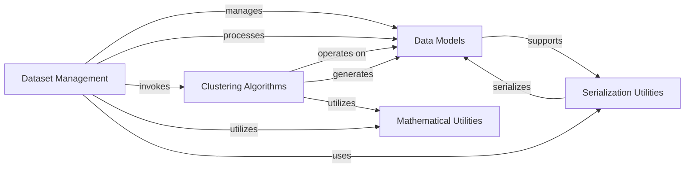

## Component Details

This component overview details the Dataset Management & Analysis subsystem of the MOCCA project. It focuses on how chemical data, represented by various data models, is managed, processed, and analyzed. The core functionality revolves around the Dataset Management component, which orchestrates operations like data loading, applying processing settings, and invoking specialized algorithms for tasks such as clustering, all while leveraging utility components for serialization and mathematical operations.

### Data Models
This component encompasses the fundamental data structures used throughout the MOCCA system, including Chromatogram, DeconvolvedPeak, Peak, Component, Compound, and Data2D. These classes define the attributes and basic behaviors of the chemical data being processed, such as conversion to and from dictionary representations for serialization.

**Related Classes/Methods**:

- <a href="https://github.com/Bayer-Group/MOCCA/blob/master/src/mocca2/classes/chromatogram.py#L27-L579" target="_blank" rel="noopener noreferrer">`MOCCA.src.mocca2.classes.chromatogram.Chromatogram` (27:579)</a>
- <a href="https://github.com/Bayer-Group/MOCCA/blob/master/src/mocca2/classes/deconvolved_peak.py#L11-L142" target="_blank" rel="noopener noreferrer">`MOCCA.src.mocca2.classes.deconvolved_peak.DeconvolvedPeak` (11:142)</a>
- <a href="https://github.com/Bayer-Group/MOCCA/blob/master/src/mocca2/classes/peak.py#L9-L67" target="_blank" rel="noopener noreferrer">`MOCCA.src.mocca2.classes.peak.Peak` (9:67)</a>
- <a href="https://github.com/Bayer-Group/MOCCA/blob/master/src/mocca2/classes/component.py#L10-L73" target="_blank" rel="noopener noreferrer">`MOCCA.src.mocca2.classes.component.Component` (10:73)</a>
- <a href="https://github.com/Bayer-Group/MOCCA/blob/master/src/mocca2/classes/compound.py#L12-L94" target="_blank" rel="noopener noreferrer">`MOCCA.src.mocca2.classes.compound.Compound` (12:94)</a>
- <a href="https://github.com/Bayer-Group/MOCCA/blob/master/src/mocca2/classes/data2d.py#L13-L321" target="_blank" rel="noopener noreferrer">`MOCCA.src.mocca2.classes.data2d.Data2D` (13:321)</a>

### Dataset Management
This component is responsible for managing collections of chromatograms and their associated processing settings. The MoccaDataset class provides functionalities for adding chromatograms, processing them through various steps like baseline correction, peak picking, deconvolution, and compound clustering, and also for retrieving processed data like area percentages and concentrations. ProcessingSettings defines the parameters for these operations.

**Related Classes/Methods**:

- <a href="https://github.com/Bayer-Group/MOCCA/blob/master/src/mocca2/dataset/dataset.py#L20-L804" target="_blank" rel="noopener noreferrer">`MOCCA.src.mocca2.dataset.dataset.MoccaDataset` (20:804)</a>
- <a href="https://github.com/Bayer-Group/MOCCA/blob/master/src/mocca2/dataset/settings.py#L10-L90" target="_blank" rel="noopener noreferrer">`MOCCA.src.mocca2.dataset.settings.ProcessingSettings` (10:90)</a>
- <a href="https://github.com/Bayer-Group/MOCCA/blob/master/src/mocca2/dataset/settings.py#L56-L59" target="_blank" rel="noopener noreferrer">`MOCCA.src.mocca2.dataset.settings.ProcessingSettings:from_yaml` (56:59)</a>
- <a href="https://github.com/Bayer-Group/MOCCA/blob/master/src/mocca2/dataset/settings.py#L61-L63" target="_blank" rel="noopener noreferrer">`MOCCA.src.mocca2.dataset.settings.ProcessingSettings:to_dict` (61:63)</a>
- <a href="https://github.com/Bayer-Group/MOCCA/blob/master/src/mocca2/dataset/settings.py#L66-L90" target="_blank" rel="noopener noreferrer">`MOCCA.src.mocca2.dataset.settings.ProcessingSettings:from_dict` (66:90)</a>
- <a href="https://github.com/Bayer-Group/MOCCA/blob/master/src/mocca2/dataset/dataset.py#L47-L55" target="_blank" rel="noopener noreferrer">`MOCCA.src.mocca2.dataset.dataset.MoccaDataset:__init__` (47:55)</a>
- <a href="https://github.com/Bayer-Group/MOCCA/blob/master/src/mocca2/dataset/dataset.py#L57-L119" target="_blank" rel="noopener noreferrer">`MOCCA.src.mocca2.dataset.dataset.MoccaDataset:add_chromatogram` (57:119)</a>
- <a href="https://github.com/Bayer-Group/MOCCA/blob/master/src/mocca2/dataset/dataset.py#L177-L262" target="_blank" rel="noopener noreferrer">`MOCCA.src.mocca2.dataset.dataset.MoccaDataset:_name_compounds` (177:262)</a>
- <a href="https://github.com/Bayer-Group/MOCCA/blob/master/src/mocca2/dataset/dataset.py#L264-L480" target="_blank" rel="noopener noreferrer">`MOCCA.src.mocca2.dataset.dataset.MoccaDataset:process_all` (264:480)</a>
- <a href="https://github.com/Bayer-Group/MOCCA/blob/master/src/mocca2/dataset/dataset.py#L755-L767" target="_blank" rel="noopener noreferrer">`MOCCA.src.mocca2.dataset.dataset.MoccaDataset:to_dict` (755:767)</a>
- <a href="https://github.com/Bayer-Group/MOCCA/blob/master/src/mocca2/dataset/dataset.py#L770-L804" target="_blank" rel="noopener noreferrer">`MOCCA.src.mocca2.dataset.dataset.MoccaDataset:from_dict` (770:804)</a>

### Clustering Algorithms
This component provides the core logic for clustering individual peak components into averaged compounds. The `cluster_components` function takes a list of components and a similarity function to group them, ultimately assigning compound IDs and creating Compound objects.

**Related Classes/Methods**:

- <a href="https://github.com/Bayer-Group/MOCCA/blob/master/src/mocca2/clustering/cluster_components.py#L10-L85" target="_blank" rel="noopener noreferrer">`MOCCA.src.mocca2.clustering.cluster_components` (10:85)</a>
- <a href="https://github.com/Bayer-Group/MOCCA/blob/master/src/mocca2/clustering/cluster_components.py#L10-L85" target="_blank" rel="noopener noreferrer">`MOCCA.src.mocca2.clustering.cluster_components:cluster_components` (10:85)</a>

### Serialization Utilities
This component provides utility functions for converting complex Python objects into dictionary representations, facilitating their serialization and deserialization. The `dict_encoder` function is a key part of this process, ensuring that data models can be easily stored and retrieved.

**Related Classes/Methods**:

- <a href="https://github.com/Bayer-Group/MOCCA/blob/master/src/mocca2/serializing.py#L5-L28" target="_blank" rel="noopener noreferrer">`mocca2.serializing.dict_encoder` (5:28)</a>

### Mathematical Utilities
This component provides common mathematical functions used across the MOCCA system, such as cosine similarity. These utilities support various analytical tasks, including the comparison of spectra during deconvolution and clustering.

**Related Classes/Methods**:

- <a href="https://github.com/Bayer-Group/MOCCA/blob/master/src/mocca2/math.py#L8-L18" target="_blank" rel="noopener noreferrer">`mocca2.math.cosine_similarity` (8:18)</a>

### [FAQ](https://github.com/CodeBoarding/GeneratedOnBoardings/tree/main?tab=readme-ov-file#faq)