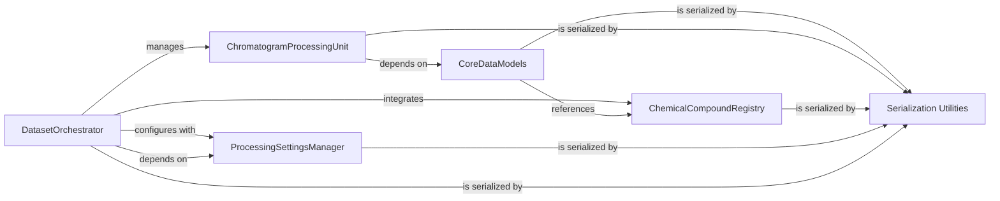

## Component Details

This architecture describes the core components of the MOCCA2 project, focusing on data processing and management. The `DatasetOrchestrator` acts as the central hub, managing `ChromatogramProcessingUnit` for individual chromatogram analysis, integrating `ChemicalCompoundRegistry` for compound definitions, and applying settings from `ProcessingSettingsManager`. Fundamental data structures are defined by `CoreDataModels`, which are processed by `ChromatogramProcessingUnit` and can reference `ChemicalCompoundRegistry`. All these key components, including `CoreDataModels`, `ChromatogramProcessingUnit`, `ChemicalCompoundRegistry`, `ProcessingSettingsManager`, and `DatasetOrchestrator`, rely on `Serialization Utilities` for converting their complex Python objects into dictionary representations, enabling persistence and data exchange.

### Serialization Utilities
Provides generic utility functions for converting complex Python objects into dictionary representations, enabling their serialization and deserialization for persistence or data exchange.

**Related Classes/Methods**:

- <a href="https://github.com/Bayer-Group/MOCCA/blob/master/src/mocca2/serializing.py#L5-L28" target="_blank" rel="noopener noreferrer">`mocca2.serializing:dict_encoder` (5:28)</a>

### CoreDataModels
Defines the fundamental data structures for representing 2D chromatographic data (Data2D), individual peaks (Peak), deconvolved peak components (DeconvolvedPeak), and single chemical components (Component).

**Related Classes/Methods**:

- <a href="https://github.com/Bayer-Group/MOCCA/blob/master/src/mocca2/classes/data2d.py#L13-L321" target="_blank" rel="noopener noreferrer">`mocca2.classes.data2d.Data2D` (13:321)</a>
- <a href="https://github.com/Bayer-Group/MOCCA/blob/master/src/mocca2/classes/peak.py#L9-L67" target="_blank" rel="noopener noreferrer">`mocca2.classes.peak.Peak` (9:67)</a>
- <a href="https://github.com/Bayer-Group/MOCCA/blob/master/src/mocca2/classes/deconvolved_peak.py#L11-L142" target="_blank" rel="noopener noreferrer">`mocca2.classes.deconvolved_peak.DeconvolvedPeak` (11:142)</a>
- <a href="https://github.com/Bayer-Group/MOCCA/blob/master/src/mocca2/classes/component.py#L10-L73" target="_blank" rel="noopener noreferrer">`mocca2.classes.component.Component` (10:73)</a>

### ChromatogramProcessingUnit
Encapsulates the logic for processing a single chromatogram, including baseline correction, peak finding, and deconvolution. It operates on and produces instances of CoreDataModels.

**Related Classes/Methods**:

- <a href="https://github.com/Bayer-Group/MOCCA/blob/master/src/mocca2/classes/chromatogram.py#L27-L579" target="_blank" rel="noopener noreferrer">`mocca2.classes.chromatogram.Chromatogram` (27:579)</a>

### ChemicalCompoundRegistry
Manages the definition and properties of chemical compounds, including their spectral characteristics and concentration factors.

**Related Classes/Methods**:

- <a href="https://github.com/Bayer-Group/MOCCA/blob/master/src/mocca2/classes/compound.py#L12-L94" target="_blank" rel="noopener noreferrer">`mocca2.classes.compound.Compound` (12:94)</a>

### ProcessingSettingsManager
Stores and manages all the configurable parameters and settings required for the automated processing of chromatographic data.

**Related Classes/Methods**:

- <a href="https://github.com/Bayer-Group/MOCCA/blob/master/src/mocca2/dataset/settings.py#L10-L90" target="_blank" rel="noopener noreferrer">`mocca2.dataset.settings.ProcessingSettings` (10:90)</a>

### DatasetOrchestrator
This is the central component that manages a collection of chromatograms and compounds. It orchestrates the entire data processing pipeline by applying settings from ProcessingSettingsManager and utilizing ChromatogramProcessingUnit for individual chromatogram analysis.

**Related Classes/Methods**:

- <a href="https://github.com/Bayer-Group/MOCCA/blob/master/src/mocca2/dataset/dataset.py#L20-L804" target="_blank" rel="noopener noreferrer">`mocca2.dataset.dataset.MoccaDataset` (20:804)</a>

### [FAQ](https://github.com/CodeBoarding/GeneratedOnBoardings/tree/main?tab=readme-ov-file#faq)