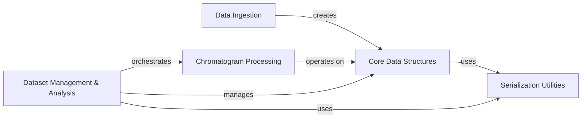

## Component Details

The MOCCA project provides a comprehensive framework for chromatographic data analysis. Its main flow involves ingesting raw instrument data into well-defined core data structures. These structures are then subjected to a series of processing steps, including baseline correction, peak detection, and deconvolution, orchestrated by the Chromatogram Processing component. For multi-sample analysis, the Dataset Management & Analysis component handles collections of processed chromatograms, applies global settings, and performs higher-level tasks like component clustering. Throughout the system, a dedicated Serialization Utilities component ensures that complex data objects can be efficiently stored and retrieved.

### Core Data Structures
Defines the fundamental data structures for representing 2D chromatographic data, individual chromatograms, and derived entities like peaks, deconvolved peaks, components, and compounds. These structures serve as the primary data carriers throughout the MOCCA system.

**Related Classes/Methods**:

- <a href="https://github.com/Bayer-Group/MOCCA/blob/master/src/mocca2/classes/data2d.py#L13-L321" target="_blank" rel="noopener noreferrer">`MOCCA.src.mocca2.classes.data2d.Data2D` (13:321)</a>
- <a href="https://github.com/Bayer-Group/MOCCA/blob/master/src/mocca2/classes/data2d.py#L28-L30" target="_blank" rel="noopener noreferrer">`MOCCA.src.mocca2.classes.data2d.Data2D:closest_time` (28:30)</a>
- <a href="https://github.com/Bayer-Group/MOCCA/blob/master/src/mocca2/classes/data2d.py#L32-L34" target="_blank" rel="noopener noreferrer">`MOCCA.src.mocca2.classes.data2d.Data2D:closest_wavelength` (32:34)</a>
- <a href="https://github.com/Bayer-Group/MOCCA/blob/master/src/mocca2/classes/data2d.py#L36-L79" target="_blank" rel="noopener noreferrer">`MOCCA.src.mocca2.classes.data2d.Data2D:extract_time` (36:79)</a>
- <a href="https://github.com/Bayer-Group/MOCCA/blob/master/src/mocca2/classes/data2d.py#L81-L126" target="_blank" rel="noopener noreferrer">`MOCCA.src.mocca2.classes.data2d.Data2D:extract_wavelength` (81:126)</a>
- <a href="https://github.com/Bayer-Group/MOCCA/blob/master/src/mocca2/classes/data2d.py#L157-L177" target="_blank" rel="noopener noreferrer">`MOCCA.src.mocca2.classes.data2d.Data2D:interpolate_time` (157:177)</a>
- <a href="https://github.com/Bayer-Group/MOCCA/blob/master/src/mocca2/classes/data2d.py#L228-L233" target="_blank" rel="noopener noreferrer">`MOCCA.src.mocca2.classes.data2d.Data2D:__add__` (228:233)</a>
- <a href="https://github.com/Bayer-Group/MOCCA/blob/master/src/mocca2/classes/data2d.py#L235-L240" target="_blank" rel="noopener noreferrer">`MOCCA.src.mocca2.classes.data2d.Data2D:__sub__` (235:240)</a>
- <a href="https://github.com/Bayer-Group/MOCCA/blob/master/src/mocca2/classes/data2d.py#L243-L251" target="_blank" rel="noopener noreferrer">`MOCCA.src.mocca2.classes.data2d.Data2D:to_dict` (243:251)</a>
- <a href="https://github.com/Bayer-Group/MOCCA/blob/master/src/mocca2/classes/data2d.py#L254-L260" target="_blank" rel="noopener noreferrer">`MOCCA.src.mocca2.classes.data2d.Data2D:from_dict` (254:260)</a>
- <a href="https://github.com/Bayer-Group/MOCCA/blob/master/src/mocca2/classes/data2d.py#L263-L290" target="_blank" rel="noopener noreferrer">`MOCCA.src.mocca2.classes.data2d.Data2D:plot` (263:290)</a>
- <a href="https://github.com/Bayer-Group/MOCCA/blob/master/src/mocca2/classes/chromatogram.py#L27-L579" target="_blank" rel="noopener noreferrer">`MOCCA.src.mocca2.classes.chromatogram.Chromatogram` (27:579)</a>
- <a href="https://github.com/Bayer-Group/MOCCA/blob/master/src/mocca2/classes/chromatogram.py#L42-L98" target="_blank" rel="noopener noreferrer">`MOCCA.src.mocca2.classes.chromatogram.Chromatogram:__init__` (42:98)</a>
- <a href="https://github.com/Bayer-Group/MOCCA/blob/master/src/mocca2/classes/chromatogram.py#L312-L349" target="_blank" rel="noopener noreferrer">`MOCCA.src.mocca2.classes.chromatogram.Chromatogram:get_area_percent` (312:349)</a>
- <a href="https://github.com/Bayer-Group/MOCCA/blob/master/src/mocca2/classes/chromatogram.py#L351-L368" target="_blank" rel="noopener noreferrer">`MOCCA.src.mocca2.classes.chromatogram.Chromatogram:get_integrals` (351:368)</a>
- <a href="https://github.com/Bayer-Group/MOCCA/blob/master/src/mocca2/classes/chromatogram.py#L370-L399" target="_blank" rel="noopener noreferrer">`MOCCA.src.mocca2.classes.chromatogram.Chromatogram:get_relative_integrals` (370:399)</a>
- <a href="https://github.com/Bayer-Group/MOCCA/blob/master/src/mocca2/classes/chromatogram.py#L476-L484" target="_blank" rel="noopener noreferrer">`MOCCA.src.mocca2.classes.chromatogram.Chromatogram:to_dict` (476:484)</a>
- <a href="https://github.com/Bayer-Group/MOCCA/blob/master/src/mocca2/classes/chromatogram.py#L487-L508" target="_blank" rel="noopener noreferrer">`MOCCA.src.mocca2.classes.chromatogram.Chromatogram:from_dict` (487:508)</a>
- <a href="https://github.com/Bayer-Group/MOCCA/blob/master/src/mocca2/classes/chromatogram.py#L511-L579" target="_blank" rel="noopener noreferrer">`MOCCA.src.mocca2.classes.chromatogram.Chromatogram:plot` (511:579)</a>
- <a href="https://github.com/Bayer-Group/MOCCA/blob/master/src/mocca2/classes/peak.py#L9-L67" target="_blank" rel="noopener noreferrer">`MOCCA.src.mocca2.classes.peak.Peak` (9:67)</a>
- <a href="https://github.com/Bayer-Group/MOCCA/blob/master/src/mocca2/classes/peak.py#L51-L53" target="_blank" rel="noopener noreferrer">`MOCCA.src.mocca2.classes.peak.Peak:to_dict` (51:53)</a>
- <a href="https://github.com/Bayer-Group/MOCCA/blob/master/src/mocca2/classes/peak.py#L56-L67" target="_blank" rel="noopener noreferrer">`MOCCA.src.mocca2.classes.peak.Peak:from_dict` (56:67)</a>
- <a href="https://github.com/Bayer-Group/MOCCA/blob/master/src/mocca2/classes/deconvolved_peak.py#L11-L142" target="_blank" rel="noopener noreferrer">`MOCCA.src.mocca2.classes.deconvolved_peak.DeconvolvedPeak` (11:142)</a>
- <a href="https://github.com/Bayer-Group/MOCCA/blob/master/src/mocca2/classes/deconvolved_peak.py#L26-L74" target="_blank" rel="noopener noreferrer">`MOCCA.src.mocca2.classes.deconvolved_peak.DeconvolvedPeak:__init__` (26:74)</a>
- <a href="https://github.com/Bayer-Group/MOCCA/blob/master/src/mocca2/classes/deconvolved_peak.py#L76-L112" target="_blank" rel="noopener noreferrer">`MOCCA.src.mocca2.classes.deconvolved_peak.DeconvolvedPeak:merge_same_components` (76:112)</a>
- <a href="https://github.com/Bayer-Group/MOCCA/blob/master/src/mocca2/classes/deconvolved_peak.py#L114-L123" target="_blank" rel="noopener noreferrer">`MOCCA.src.mocca2.classes.deconvolved_peak.DeconvolvedPeak:to_dict` (114:123)</a>
- <a href="https://github.com/Bayer-Group/MOCCA/blob/master/src/mocca2/classes/deconvolved_peak.py#L126-L142" target="_blank" rel="noopener noreferrer">`MOCCA.src.mocca2.classes.deconvolved_peak.DeconvolvedPeak:from_dict` (126:142)</a>
- <a href="https://github.com/Bayer-Group/MOCCA/blob/master/src/mocca2/classes/component.py#L10-L73" target="_blank" rel="noopener noreferrer">`MOCCA.src.mocca2.classes.component.Component` (10:73)</a>
- <a href="https://github.com/Bayer-Group/MOCCA/blob/master/src/mocca2/classes/component.py#L51-L56" target="_blank" rel="noopener noreferrer">`MOCCA.src.mocca2.classes.component.Component:to_dict` (51:56)</a>
- <a href="https://github.com/Bayer-Group/MOCCA/blob/master/src/mocca2/classes/component.py#L59-L73" target="_blank" rel="noopener noreferrer">`MOCCA.src.mocca2.classes.component.Component:from_dict` (59:73)</a>
- <a href="https://github.com/Bayer-Group/MOCCA/blob/master/src/mocca2/classes/compound.py#L12-L94" target="_blank" rel="noopener noreferrer">`MOCCA.src.mocca2.classes.compound.Compound` (12:94)</a>
- <a href="https://github.com/Bayer-Group/MOCCA/blob/master/src/mocca2/classes/compound.py#L69-L73" target="_blank" rel="noopener noreferrer">`MOCCA.src.mocca2.classes.compound.Compound:to_dict` (69:73)</a>
- <a href="https://github.com/Bayer-Group/MOCCA/blob/master/src/mocca2/classes/compound.py#L76-L94" target="_blank" rel="noopener noreferrer">`MOCCA.src.mocca2.classes.compound.Compound:from_dict` (76:94)</a>

### Data Ingestion
Responsible for parsing raw chromatographic data from various instrument-specific formats (e.g., Chemstation, Labsolutions) into the internal Core Data Structures. It also provides access to example datasets for testing and demonstration.

**Related Classes/Methods**:

- <a href="https://github.com/Bayer-Group/MOCCA/blob/master/src/mocca2/parsers/chemstation.py#L6-L20" target="_blank" rel="noopener noreferrer">`MOCCA.src.mocca2.parsers.chemstation:parse_chemstation` (6:20)</a>
- <a href="https://github.com/Bayer-Group/MOCCA/blob/master/src/mocca2/parsers/labsolutions.py#L5-L17" target="_blank" rel="noopener noreferrer">`MOCCA.src.mocca2.parsers.labsolutions:parse_labsolutions` (5:17)</a>
- <a href="https://github.com/Bayer-Group/MOCCA/blob/master/src/mocca2/parsers/empower.py#L6-L30" target="_blank" rel="noopener noreferrer">`MOCCA.src.mocca2.parsers.empower:parse_empower` (6:30)</a>
- <a href="https://github.com/Bayer-Group/MOCCA/blob/master/src/mocca2/parsers/masslynx.py#L8-L17" target="_blank" rel="noopener noreferrer">`MOCCA.src.mocca2.parsers.masslynx:parse_masslynx` (8:17)</a>
- <a href="https://github.com/Bayer-Group/MOCCA/blob/master/src/mocca2/parsers/wrapper.py#L10-L69" target="_blank" rel="noopener noreferrer">`MOCCA.src.mocca2.parsers.wrapper:load_data2d` (10:69)</a>
- <a href="https://github.com/Bayer-Group/MOCCA/blob/master/src/mocca2/example_data/downloader.py#L24-L44" target="_blank" rel="noopener noreferrer">`MOCCA.src.mocca2.example_data.downloader:download_data` (24:44)</a>
- <a href="https://github.com/Bayer-Group/MOCCA/blob/master/src/mocca2/example_data/downloader.py#L47-L67" target="_blank" rel="noopener noreferrer">`MOCCA.src.mocca2.example_data.downloader:unpack_data` (47:67)</a>
- <a href="https://github.com/Bayer-Group/MOCCA/blob/master/src/mocca2/example_data/loaders.py#L13-L20" target="_blank" rel="noopener noreferrer">`MOCCA.src.mocca2.example_data.loaders:check_data_needs_downloading` (13:20)</a>
- <a href="https://github.com/Bayer-Group/MOCCA/blob/master/src/mocca2/example_data/loaders.py#L23-L36" target="_blank" rel="noopener noreferrer">`MOCCA.src.mocca2.example_data.loaders:example_1` (23:36)</a>
- <a href="https://github.com/Bayer-Group/MOCCA/blob/master/src/mocca2/example_data/loaders.py#L39-L52" target="_blank" rel="noopener noreferrer">`MOCCA.src.mocca2.example_data.loaders:example_2` (39:52)</a>
- <a href="https://github.com/Bayer-Group/MOCCA/blob/master/src/mocca2/example_data/loaders.py#L55-L68" target="_blank" rel="noopener noreferrer">`MOCCA.src.mocca2.example_data.loaders:example_3` (55:68)</a>
- <a href="https://github.com/Bayer-Group/MOCCA/blob/master/src/mocca2/example_data/loaders.py#L71-L168" target="_blank" rel="noopener noreferrer">`MOCCA.src.mocca2.example_data.loaders:knoevenagel_calibration` (71:168)</a>
- <a href="https://github.com/Bayer-Group/MOCCA/blob/master/src/mocca2/example_data/loaders.py#L171-L264" target="_blank" rel="noopener noreferrer">`MOCCA.src.mocca2.example_data.loaders:knoevenagel` (171:264)</a>
- <a href="https://github.com/Bayer-Group/MOCCA/blob/master/src/mocca2/example_data/loaders.py#L267-L321" target="_blank" rel="noopener noreferrer">`MOCCA.src.mocca2.example_data.loaders:cyanation` (267:321)</a>
- <a href="https://github.com/Bayer-Group/MOCCA/blob/master/src/mocca2/example_data/loaders.py#L324-L338" target="_blank" rel="noopener noreferrer">`MOCCA.src.mocca2.example_data.loaders:benzaldehyde` (324:338)</a>
- <a href="https://github.com/Bayer-Group/MOCCA/blob/master/src/mocca2/example_data/loaders.py#L341-L423" target="_blank" rel="noopener noreferrer">`MOCCA.src.mocca2.example_data.loaders:diterpene_esters` (341:423)</a>

### Chromatogram Processing
Provides the core functionalities for processing individual chromatograms, including baseline correction, peak detection (finding, splitting, merging), and deconvolution of overlapping peaks using various algorithms and peak models.

**Related Classes/Methods**:

- <a href="https://github.com/Bayer-Group/MOCCA/blob/master/src/mocca2/classes/chromatogram.py#L100-L145" target="_blank" rel="noopener noreferrer">`MOCCA.src.mocca2.classes.chromatogram.Chromatogram:correct_baseline` (100:145)</a>
- <a href="https://github.com/Bayer-Group/MOCCA/blob/master/src/mocca2/classes/chromatogram.py#L147-L229" target="_blank" rel="noopener noreferrer">`MOCCA.src.mocca2.classes.chromatogram.Chromatogram:find_peaks` (147:229)</a>
- <a href="https://github.com/Bayer-Group/MOCCA/blob/master/src/mocca2/classes/chromatogram.py#L231-L295" target="_blank" rel="noopener noreferrer">`MOCCA.src.mocca2.classes.chromatogram.Chromatogram:deconvolve_peaks` (231:295)</a>
- <a href="https://github.com/Bayer-Group/MOCCA/blob/master/src/mocca2/classes/chromatogram.py#L401-L473" target="_blank" rel="noopener noreferrer">`MOCCA.src.mocca2.classes.chromatogram.Chromatogram:refine_peaks` (401:473)</a>
- <a href="https://github.com/Bayer-Group/MOCCA/blob/master/src/mocca2/baseline/arpls.py#L17-L147" target="_blank" rel="noopener noreferrer">`MOCCA.src.mocca2.baseline.arpls:arpls` (17:147)</a>
- <a href="https://github.com/Bayer-Group/MOCCA/blob/master/src/mocca2/baseline/asls.py#L15-L129" target="_blank" rel="noopener noreferrer">`MOCCA.src.mocca2.baseline.asls:asls` (15:129)</a>
- <a href="https://github.com/Bayer-Group/MOCCA/blob/master/src/mocca2/baseline/wrapper.py#L16-L98" target="_blank" rel="noopener noreferrer">`MOCCA.src.mocca2.baseline.wrapper:estimate_baseline` (16:98)</a>
- <a href="https://github.com/Bayer-Group/MOCCA/blob/master/src/mocca2/peaks/find_peaks.py#L13-L101" target="_blank" rel="noopener noreferrer">`MOCCA.src.mocca2.peaks.find_peaks:find_peaks` (13:101)</a>
- <a href="https://github.com/Bayer-Group/MOCCA/blob/master/src/mocca2/peaks/find_peaks.py#L104-L134" target="_blank" rel="noopener noreferrer">`MOCCA.src.mocca2.peaks.find_peaks:_initial_peak_picking` (104:134)</a>
- <a href="https://github.com/Bayer-Group/MOCCA/blob/master/src/mocca2/peaks/split.py#L8-L33" target="_blank" rel="noopener noreferrer">`MOCCA.src.mocca2.peaks.split:split_peaks` (8:33)</a>
- <a href="https://github.com/Bayer-Group/MOCCA/blob/master/src/mocca2/peaks/split.py#L35-L85" target="_blank" rel="noopener noreferrer">`MOCCA.src.mocca2.peaks.split:_split_peak` (35:85)</a>
- <a href="https://github.com/Bayer-Group/MOCCA/blob/master/src/mocca2/peaks/merge_overlapping.py#L7-L40" target="_blank" rel="noopener noreferrer">`MOCCA.src.mocca2.peaks.merge_overlapping:merge_overlapping_peaks` (7:40)</a>
- <a href="https://github.com/Bayer-Group/MOCCA/blob/master/src/mocca2/peaks/merge_overlapping.py#L49-L60" target="_blank" rel="noopener noreferrer">`MOCCA.src.mocca2.peaks.merge_overlapping:_merge_two_peaks` (49:60)</a>
- <a href="https://github.com/Bayer-Group/MOCCA/blob/master/src/mocca2/deconvolution/deconvolve.py#L11-L74" target="_blank" rel="noopener noreferrer">`MOCCA.src.mocca2.deconvolution.deconvolve:deconvolve_adaptive` (11:74)</a>
- <a href="https://github.com/Bayer-Group/MOCCA/blob/master/src/mocca2/deconvolution/deconvolve.py#L77-L126" target="_blank" rel="noopener noreferrer">`MOCCA.src.mocca2.deconvolution.deconvolve:deconvolve_fixed` (77:126)</a>
- <a href="https://github.com/Bayer-Group/MOCCA/blob/master/src/mocca2/deconvolution/fit_peak_model.py#L20-L264" target="_blank" rel="noopener noreferrer">`MOCCA.src.mocca2.deconvolution.fit_peak_model:fit_peak_model` (20:264)</a>
- <a href="https://github.com/Bayer-Group/MOCCA/blob/master/src/mocca2/deconvolution/guess_spectra.py#L11-L54" target="_blank" rel="noopener noreferrer">`MOCCA.src.mocca2.deconvolution.guess_spectra:guess_spectra` (11:54)</a>
- <a href="https://github.com/Bayer-Group/MOCCA/blob/master/src/mocca2/deconvolution/guess_spectra.py#L57-L69" target="_blank" rel="noopener noreferrer">`MOCCA.src.mocca2.deconvolution.guess_spectra:_get_similarity_matrix` (57:69)</a>
- <a href="https://github.com/Bayer-Group/MOCCA/blob/master/src/mocca2/deconvolution/alternating_lstsq.py#L12-L105" target="_blank" rel="noopener noreferrer">`MOCCA.src.mocca2.deconvolution.alternating_lstsq:alternating_lstsq` (12:105)</a>
- <a href="https://github.com/Bayer-Group/MOCCA/blob/master/src/mocca2/deconvolution/nonnegative_lstsq.py#L11-L53" target="_blank" rel="noopener noreferrer">`MOCCA.src.mocca2.deconvolution.nonnegative_lstsq:concentrations_from_spectra` (11:53)</a>
- <a href="https://github.com/Bayer-Group/MOCCA/blob/master/src/mocca2/deconvolution/nonnegative_lstsq.py#L56-L83" target="_blank" rel="noopener noreferrer">`MOCCA.src.mocca2.deconvolution.nonnegative_lstsq:spectra_from_concentrations` (56:83)</a>
- <a href="https://github.com/Bayer-Group/MOCCA/blob/master/src/mocca2/deconvolution/peak_models.py#L17-L21" target="_blank" rel="noopener noreferrer">`MOCCA.src.mocca2.deconvolution.peak_models.PeakModel:__call__` (17:21)</a>
- <a href="https://github.com/Bayer-Group/MOCCA/blob/master/src/mocca2/deconvolution/peak_models.py#L246-L266" target="_blank" rel="noopener noreferrer">`MOCCA.src.mocca2.deconvolution.peak_models.Bemg:val` (246:266)</a>
- <a href="https://github.com/Bayer-Group/MOCCA/blob/master/src/mocca2/deconvolution/peak_models.py#L268-L310" target="_blank" rel="noopener noreferrer">`MOCCA.src.mocca2.deconvolution.peak_models.Bemg:grad` (268:310)</a>
- <a href="https://github.com/Bayer-Group/MOCCA/blob/master/src/mocca2/deconvolution/peak_models.py#L80-L115" target="_blank" rel="noopener noreferrer">`MOCCA.src.mocca2.deconvolution.peak_models.BiGaussian` (80:115)</a>
- <a href="https://github.com/Bayer-Group/MOCCA/blob/master/src/mocca2/deconvolution/peak_models.py#L118-L167" target="_blank" rel="noopener noreferrer">`MOCCA.src.mocca2.deconvolution.peak_models.BiGaussianTailing` (118:167)</a>
- <a href="https://github.com/Bayer-Group/MOCCA/blob/master/src/mocca2/deconvolution/peak_models.py#L170-L230" target="_blank" rel="noopener noreferrer">`MOCCA.src.mocca2.deconvolution.peak_models.FraserSuzuki` (170:230)</a>

### Dataset Management & Analysis
Manages collections of Chromatogram objects, applies processing settings across multiple datasets, and performs higher-level analytical tasks such as clustering components to identify common compounds.

**Related Classes/Methods**:

- <a href="https://github.com/Bayer-Group/MOCCA/blob/master/src/mocca2/dataset/dataset.py#L20-L804" target="_blank" rel="noopener noreferrer">`MOCCA.src.mocca2.dataset.dataset.MoccaDataset` (20:804)</a>
- <a href="https://github.com/Bayer-Group/MOCCA/blob/master/src/mocca2/dataset/settings.py#L10-L90" target="_blank" rel="noopener noreferrer">`MOCCA.src.mocca2.dataset.settings.ProcessingSettings` (10:90)</a>
- <a href="https://github.com/Bayer-Group/MOCCA/blob/master/src/mocca2/dataset/settings.py#L56-L59" target="_blank" rel="noopener noreferrer">`MOCCA.src.mocca2.dataset.settings.ProcessingSettings:from_yaml` (56:59)</a>
- <a href="https://github.com/Bayer-Group/MOCCA/blob/master/src/mocca2/dataset/settings.py#L61-L63" target="_blank" rel="noopener noreferrer">`MOCCA.src.mocca2.dataset.settings.ProcessingSettings:to_dict` (61:63)</a>
- <a href="https://github.com/Bayer-Group/MOCCA/blob/master/src/mocca2/dataset/settings.py#L66-L90" target="_blank" rel="noopener noreferrer">`MOCCA.src.mocca2.dataset.settings.ProcessingSettings:from_dict` (66:90)</a>
- <a href="https://github.com/Bayer-Group/MOCCA/blob/master/src/mocca2/dataset/dataset.py#L47-L55" target="_blank" rel="noopener noreferrer">`MOCCA.src.mocca2.dataset.dataset.MoccaDataset:__init__` (47:55)</a>
- <a href="https://github.com/Bayer-Group/MOCCA/blob/master/src/mocca2/dataset/dataset.py#L57-L119" target="_blank" rel="noopener noreferrer">`MOCCA.src.mocca2.dataset.dataset.MoccaDataset:add_chromatogram` (57:119)</a>
- <a href="https://github.com/Bayer-Group/MOCCA/blob/master/src/mocca2/dataset/dataset.py#L177-L262" target="_blank" rel="noopener noreferrer">`MOCCA.src.mocca2.dataset.dataset.MoccaDataset:_name_compounds` (177:262)</a>
- <a href="https://github.com/Bayer-Group/MOCCA/blob/master/src/mocca2/dataset/dataset.py#L264-L480" target="_blank" rel="noopener noreferrer">`MOCCA.src.mocca2.dataset.dataset.MoccaDataset:process_all` (264:480)</a>
- <a href="https://github.com/Bayer-Group/MOCCA/blob/master/src/mocca2/dataset/dataset.py#L755-L767" target="_blank" rel="noopener noreferrer">`MOCCA.src.mocca2.dataset.dataset.MoccaDataset:to_dict` (755:767)</a>
- <a href="https://github.com/Bayer-Group/MOCCA/blob/master/src/mocca2/dataset/dataset.py#L770-L804" target="_blank" rel="noopener noreferrer">`MOCCA.src.mocca2.dataset.dataset.MoccaDataset:from_dict` (770:804)</a>
- <a href="https://github.com/Bayer-Group/MOCCA/blob/master/src/mocca2/clustering/cluster_components.py#L10-L85" target="_blank" rel="noopener noreferrer">`MOCCA.src.mocca2.clustering.cluster_components:cluster_components` (10:85)</a>

### Serialization Utilities
Provides generic utility functions for converting complex Python objects into dictionary representations, enabling their serialization and deserialization for persistence or data exchange.

**Related Classes/Methods**:

- <a href="https://github.com/Bayer-Group/MOCCA/blob/master/src/mocca2/serializing.py#L5-L28" target="_blank" rel="noopener noreferrer">`MOCCA.src.mocca2.serializing:dict_encoder` (5:28)</a>

### [FAQ](https://github.com/CodeBoarding/GeneratedOnBoardings/tree/main?tab=readme-ov-file#faq)